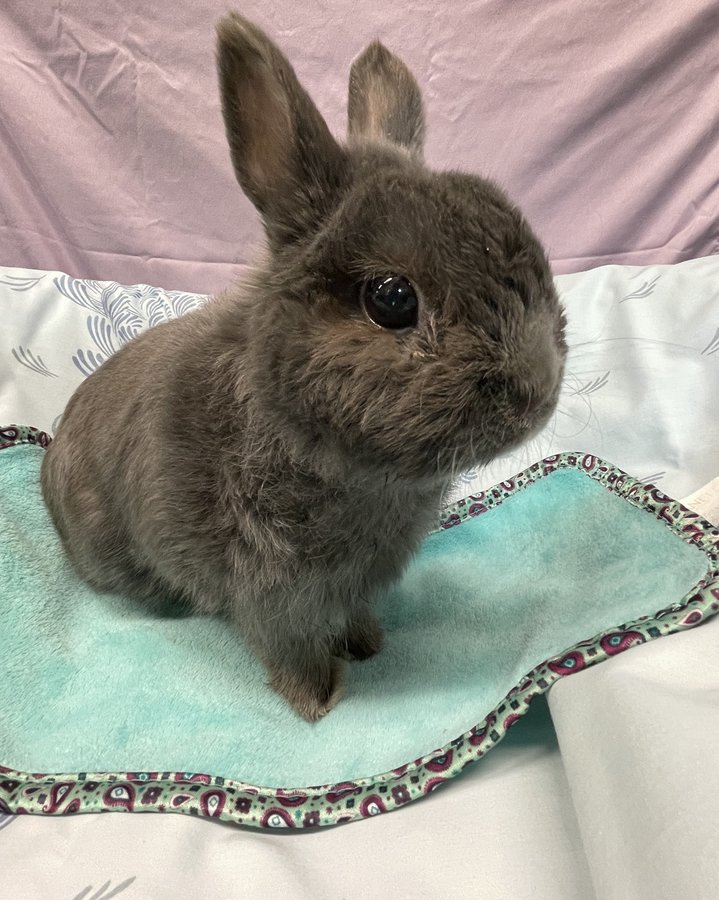
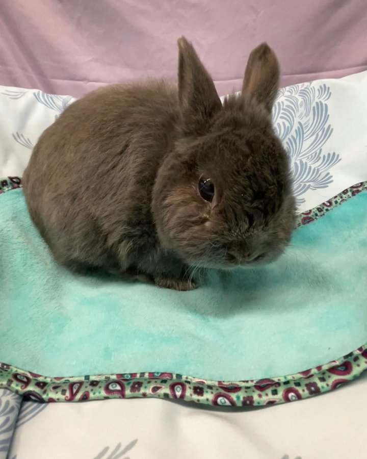

Meet the newest member of our sanctuary family: Mr. Buttons. He is approximately 10 years old, he is cute as an absolute button, and he has had a very rough go of it — but that is all about to change.

<!-- truncate -->

*Mr. Buttons, settling in and already stealing hearts.*

## His Story

Mr. Buttons came to us through our friends at RBARI. His previous family had him for his entire life — about 10 years — but there were two significant problems with his care that have left him in rough shape.

First, his family thought he was a girl for all 10 years they had him. This is not uncommon with rabbits, as sexing them can be tricky, but it meant he never received any reproductive health care appropriate for a male rabbit.

Second, and more critically, he was fed **guinea pig pellets** for the entirety of his life. Guinea pig pellets are formulated for guinea pigs, not rabbits — they have very different nutritional profiles. Rabbits fed an improper diet over many years can develop serious health issues related to malnutrition and organ stress.

Combined with his age and the stress of surrender, Mr. Buttons was not doing well when he came to us.

*Already looking more comfortable.*

## His Future

Mr. Buttons will either be a permanent sanctuary member with Jen or Danni. We are not rushing anything — his first priority is getting the proper nutrition, veterinary care, and rest he needs to start feeling better.

Senior rabbits can live very comfortably with the right care, and we are committed to giving Mr. Buttons the best possible quality of life for whatever time he has left. He deserves to know what it feels like to be truly well cared for.

:::warning Important: Rabbit Nutrition
Rabbits have very specific dietary needs that differ significantly from other small animals. **Never feed a rabbit guinea pig pellets** — they lack the proper nutrients and can cause serious long-term health problems. Learn more in our [rabbit nutrition guide](/docs/Rabbits/getting-started/basic-care).
:::

Welcome home, Mr. Buttons. You are going to be just fine. 🐰

<SupportUs />
