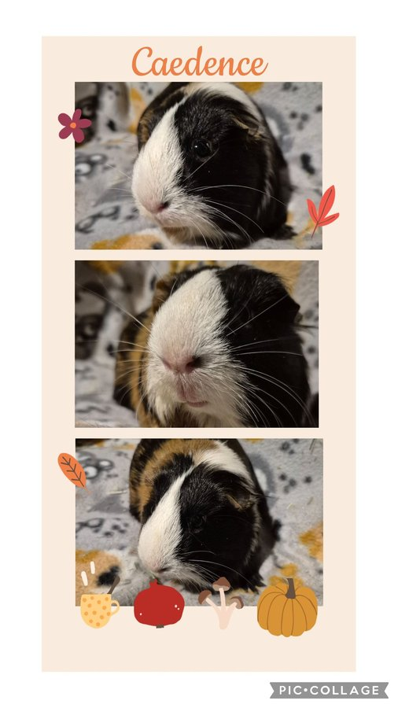

We got surprisingly wonderful news at the vet this week, and we just have to share it. Caedence is doing better than ever — and given everything she has been through, that is nothing short of remarkable.

<!-- truncate -->

*Caedence, thriving.*

## Where She Came From

Caedence came to us in fall 2024 from a hoarding case. She was pregnant when she arrived, and that pregnancy was the most precarious one we have ever managed. So many sleepless nights hand-feeding her. So many emergency vet trips. It was utterly exhausting — but we were not going to give up on her.

She has a **heart condition**, and her pregnancy greatly exacerbated it. Managing a pregnant guinea pig with a cardiac condition is genuinely one of the most stressful things we have done. But she made it. Her babies were born, and once they were weaned, her heart condition began to calm down.

## The Good News

At her general wellness exam this week, her heart is doing **even better than on her last exam**. Her weight is great. Her overall condition is excellent.

This is the kind of update that makes every sleepless night worth it.

We are also staying in touch with the families who adopted her babies, so we can monitor whether any of them develop heart issues as they age. Heart conditions in guinea pigs can have a genetic component, and we want to make sure their adopters are informed and watching.

:::info Guinea Pig Heart Disease
Heart disease is more common in guinea pigs than many people realize. Learn about the signs to watch for and how it is managed in our [guinea pig heart disease resource](/docs/guinea-pigs/illnesses-and-conditions/common-health-issues).
:::

You are a fighter, Caedence. We are so proud of you. 💛

<SupportUs />
