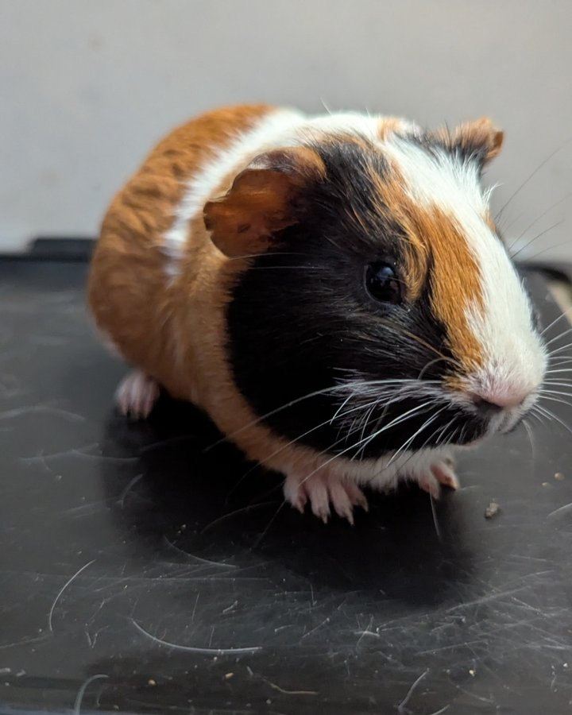

For those of you who remember back in October when we had that group of piggies that was handed to Jen in a box — this is Ducky's update, and it is a good one.

<!-- truncate -->

*Ducky, the biggest personality in the smallest package.*

## The Box Babies

Last fall, a group of guinea pigs was surrendered to Jen in a box — an unfortunately common way small animals end up in rescue. Most of that group has since been adopted into wonderful homes. But Ducky, we held back for a while.

There was nothing medically wrong with her. She was just... a lot. The largest of the babies, very sassy, and a bit of a bulldozer. We were concerned that if she went home with one of her siblings, she would just steamroll them. She needed to go somewhere where she could be herself without causing chaos.

## The Perfect Solution

We knew exactly what to do: introduce her to our big group of resident females. These ladies would not put up with her nonsense — but they also would not pick a fight with her. They would simply put her in her place, calmly and firmly, and she would learn.

And that is exactly what happened.

  

    
  

  

    
  

Ducky has settled in beautifully with the group. She found her place, she learned the social rules, and she is thriving. Sometimes the best adoption story is the one where an animal finds exactly the right environment to grow into who they are meant to be.

Welcome to the herd, Ducky. 💛

<SupportUs />
