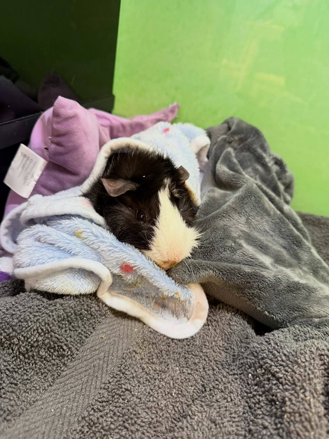

February is Pet Dental Health Month, and our friends at [Wheektopia Guinea Pig Care and Rescue Center](https://www.facebook.com/Wheektopia) have given us permission to share an extreme case they are currently managing. PB's story is a powerful reminder of why routine wellness exams matter — even for the smallest of animals.

<!-- truncate -->

## PB's Story

PB was surrendered to Wheektopia with **chronic malocclusion** — a condition where the teeth do not align properly and continue to overgrow in painful, damaging ways. He has to get his teeth trimmed every single month to prevent them from reaching the state shown in the before photo below.

  

    
    
<em>Before: severe overgrowth and malocclusion</em>

  

  

    
    
<em>After: trimmed and much more comfortable</em>

  

This is one of the many reasons we advocate so strongly for **routine wellness checks** for even the smallest of critters.

## Why Early Detection Matters So Much

When dental issues are caught early — when the molars only have small points starting to develop — the correction is relatively minor. A simple trim, a little discomfort, and the guinea pig is back to eating normally within a day or two.

When dental issues are left untreated, the overgrown teeth cause jaw pain so severe that the guinea pig stops eating hay. And hay is the primary thing that keeps guinea pig teeth worn down naturally. So the problem compounds: the more it hurts to chew hay, the less hay they eat, and the faster the teeth overgrow. It becomes a cycle that is very difficult to break.

*PB after his most recent trim — already looking more comfortable.*

By getting teeth trimmed when there are only small points, there is much less jaw pain in the long run. Guinea pigs who receive regular dental care eat more hay, which keeps their teeth trimmer between appointments, which means less intervention needed over time.

## "Routine Exams Aren't Necessary"

We see this sentiment in guinea pig groups far too often, and we want to address it directly: **routine wellness exams are absolutely necessary.**

Veterinary science has come leaps and bounds for exotic animals. There are now vets who specialize in small mammals and have the equipment and training to catch dental issues, heart conditions, respiratory problems, and more — long before they become emergencies. Waiting until your guinea pig is visibly sick often means waiting until they are critically ill.

:::tip Our Dental Resources
We have detailed guides on dental health for guinea pigs. Check out our [guinea pig dental disease guide](/docs/guinea-pigs/health-and-wellness/dental-disease) and [dental health overview](/docs/guinea-pigs/health-and-wellness/dental-health) for everything you need to know about keeping your pig's teeth healthy.
:::

Don't wait until it's too late. Schedule that wellness exam. 💛

*Thank you to Wheektopia for allowing us to share PB's story. You can follow their work on [Facebook](https://www.facebook.com/Wheektopia).*

<SupportUs />
