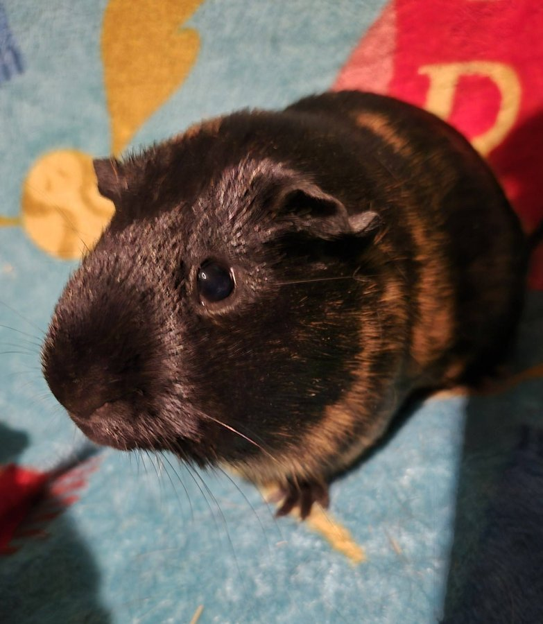
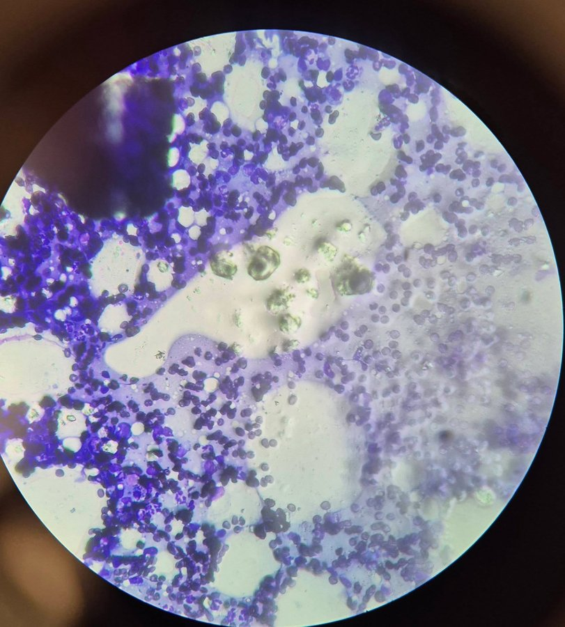

We have an update on Halloween, one of our young sanctuary guinea pigs, and while it is not the news we were hoping for, it is much better than it could have been — and it is a story worth sharing about the importance of catching things early.

<!-- truncate -->

*Halloween, only 5 months old and already showing us what a fighter she is.*

## The Discovery

Halloween is only 5 months old. During a routine check, we noticed a mass developing. We had it tested right away, and the results came back: it is a **mammary tumor**, but at this time it is showing only inflammation cells and mammary tissue — not malignant cancer cells.

That is the best possible news given the circumstances.

However, in just two days, the mass changed dramatically in size, shape, and texture. That kind of rapid change tells us we need to act. We are anticipating needing to remove it surgically.

## Why We Test Everything

Some people might wonder why we bother testing a mass in a 5-month-old guinea pig. The answer is simple: **we test everything, because knowing what we are dealing with changes how we treat it.**

A benign mass that is growing rapidly still needs to come out — but knowing it is not currently malignant gives us more flexibility in timing and approach. If it were malignant, we would be moving even faster.

*Resting up before her procedure.*

## Mammary Tumors in Guinea Pigs

Mammary tumors are not uncommon in guinea pigs, and they can occur in both females and males. They can be benign or malignant, and the only way to know which is through testing. A mass that appears benign can also change over time, which is why monitoring and early intervention are so important.

Signs to watch for in your guinea pig:
- Any new lump or bump, especially along the belly or chest
- A mass that changes in size, shape, or texture
- Skin changes around a lump (redness, ulceration, discharge)
- Changes in appetite or behavior

:::tip Cancer Resources
Learn more about tumors and cancer in guinea pigs in our [guinea pig cancer guide](/docs/guinea-pigs/illnesses-and-conditions/cancer). Early detection and prompt veterinary care make a significant difference in outcomes.
:::

We will keep you updated on Halloween's recovery. She is a tough little girl, and we are in her corner every step of the way. 💛

<SupportUs />
