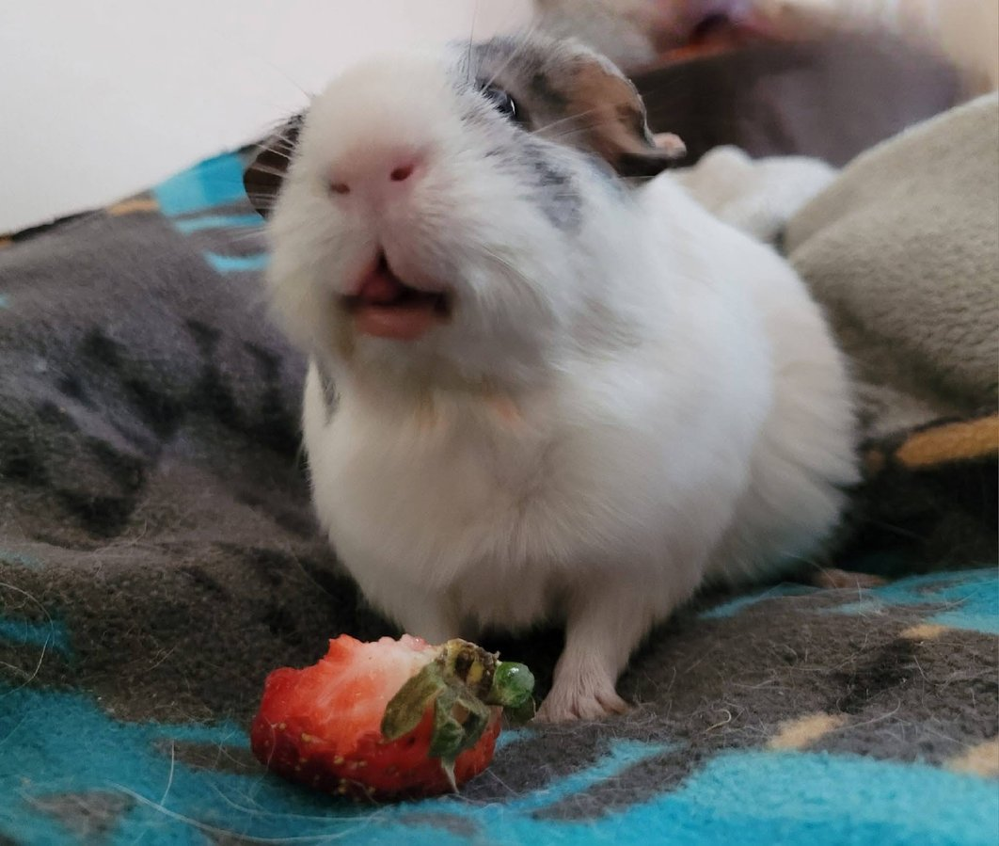
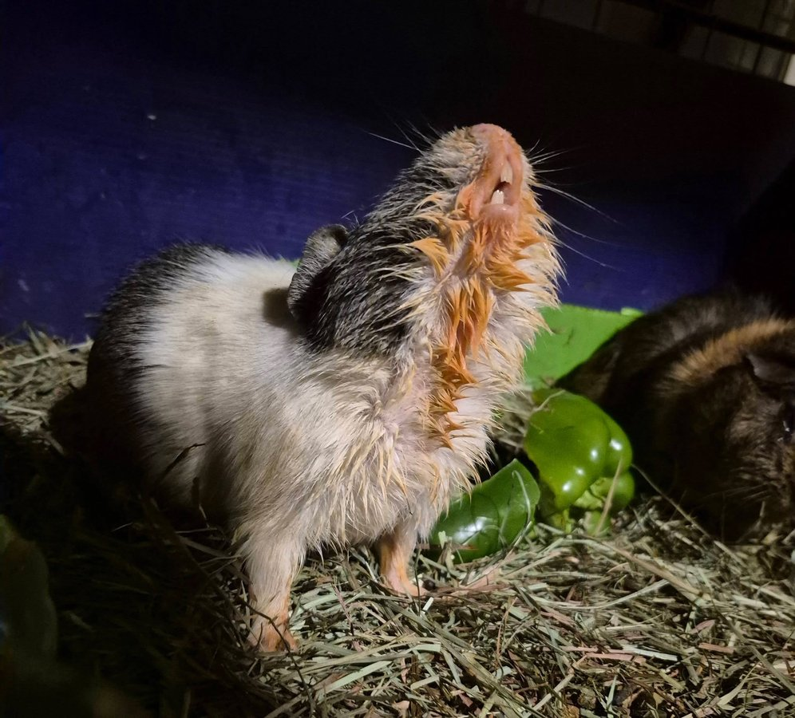

Our sweet senior, Ophelia, passed away yesterday. She had been with me for almost four years, putting her at around eight years old — a remarkable age for a guinea pig. She was one of the most joyful animals I have ever had the privilege of caring for.

<!-- truncate -->

*Ophelia, the happiest girl in the world.*

## Her Story

Ophelia had a neurological event years ago that left her very wobbly and blind. For many animals, that kind of disability would mean a diminished quality of life. For Ophelia, it barely slowed her down.

She remained the happiest girl in the world. She navigated her space by memory and by feel. She knew where her hay was, where her pellets were, and where the best spots to nap were. She adapted completely, and she thrived.

  

    
  

  

    
  

## Our Special Time

Over the past year, I set aside dedicated time every day just to sit with Ophelia. I would give her her arthritis medication and then we would sit together in the rocking chair and listen to music. She would settle in, relax, and just be present. Those moments were some of the most peaceful of my day.

I am so grateful we had that time together. I am so grateful she got to live eight full years, and that the last four of them were spent being loved and cared for every single day.

  

    
  

  

    
  

*Ophelia in her favorite spot, right where she belonged.*

## Why Sanctuary Matters

Ophelia is exactly why we do sanctuary care. She was a senior animal with a neurological condition and arthritis. Many rescues and shelters would not have had the capacity or the knowledge to manage her needs. We did, and because of that, she got four more years of a good life.

That is what this work is about.

Popcorn free, sweet girl. We will miss every little thing about you. 🌈

<SupportUs />
