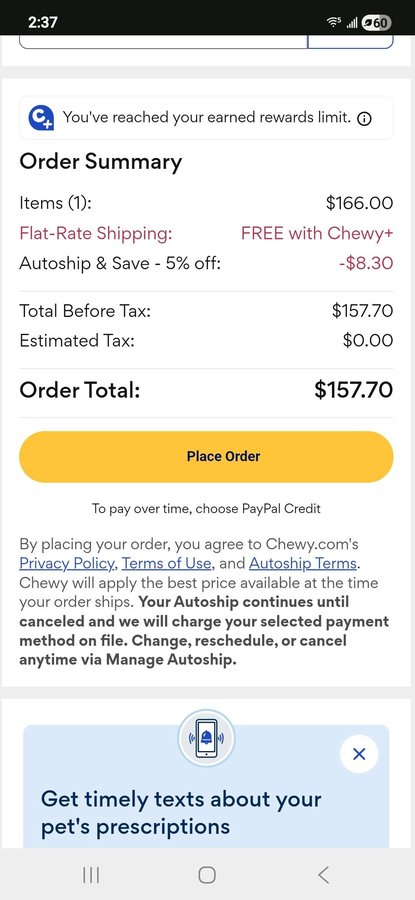

This is Tally — our second oldest guinea pig in the rescue, and one of the animals who inspired us to try something new in our approach to arthritis management. We want to share what we are learning, because it may be useful to other guinea pig owners managing senior animals.

<!-- truncate -->

*Tally, our wise and well-loved senior.*

## Tally's Background

Tally is a sweet old lady who has been with us for a long time. She needed to put on some weight when she arrived, but in this house, that was easy to fix. Over time, she developed bony changes — particularly in her ankles. The changes were significant enough that I could feel the difference when handling her, which is not something I can normally detect.

She has been on oral arthritis medication for a while now, and it has helped. But oral medications for guinea pigs come with some drawbacks that we have been thinking about carefully.

## The Problem with Long-Term Oral Medications

Daily oral medications for guinea pigs are effective, but they have real limitations:

- They can be hard on the **kidneys and liver** over the long term
- They require **daily administration** — which adds up to hours of time each week across multiple animals
- Guinea pigs often resist them, making the process stressful for both animal and caregiver
- We go through them **very quickly** when managing multiple patients

When you have a rescue with multiple senior animals on arthritis management, these limitations become significant.

## Enter Adequan

We had a very interesting conversation with our veterinarian about **Adequan** — an injectable arthritis medication typically used for dogs, but showing a lot of promise (and zero side effects so far) for guinea pigs.

*Tally in one of her favorite resting spots.*

Here is why we are excited about it:

**The schedule:** After an initial loading period, guinea pigs would only need injections every three weeks. Compare that to oral medication every single day, and the time savings are enormous.

**The dosage:** Guinea pigs need only a tiny amount — far less than dogs. This means a supply lasts much longer than oral medications.

**The side effect profile:** So far, the research and clinical experience suggest Adequan is very well tolerated in guinea pigs with no significant side effects.

**The potential for satin guinea pigs:** We are particularly curious about how Adequan will work for our satin guinea pigs with osteodystrophy — a bone density condition associated with the satin gene. This is an area where we are hoping to gather meaningful data.

## Our Plan

We are starting with a small sample and documenting each guinea pig's progress carefully. (Yes, this means more spreadsheets. I genuinely love spreadsheets.) As we see results, we will add more animals to the trial.

This is exactly the kind of thing we mean when we talk about following the research and keeping an open mind as veterinary science evolves. We are not just managing these animals — we are learning alongside their vets and contributing to the growing body of knowledge about exotic mammal care.

:::tip Satin Syndrome Resources
If you have a satin guinea pig, learn more about the genetic condition and what it means for long-term care in our [Satin Syndrome guide](/docs/guinea-pigs/breeds-and-genetics/satinsyndrome).
:::

We will keep sharing updates as we learn more. 💛

<SupportUs />
