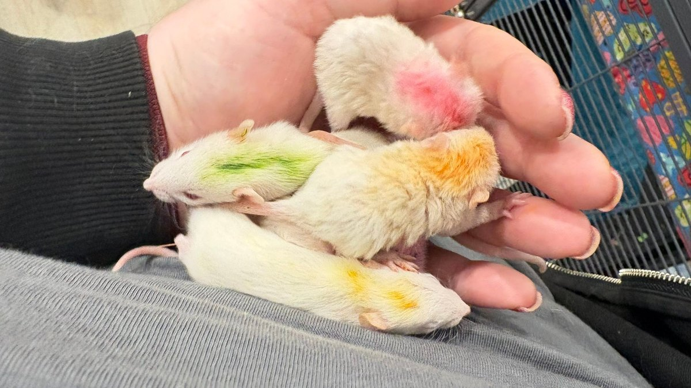

I am losing my mind over how cute these babies are, and I need you all to know about them.

We pulled a few dozen rats from [Strong Island Animal Rescue League](https://www.facebook.com/strongislandanimalrescueleague), who have been working on a monumental pet rat hoarding case on Long Island. When they reached out asking if we could help, I figured: who needs a kitchen? I set up an enormous cage and took in as many as I possibly could.

<!-- truncate -->

## The Situation

This was a large-scale hoarding case involving a significant number of pet rats living in conditions that were not appropriate for their care. Strong Island Animal Rescue League has been doing incredible work managing the removal and initial care of these animals, and we are honored to be one of the rescues they trusted to take some of them in.

  

    
  

  

    
  

  

    
  

## Teen Moms and Tiny Babies

These ladies have had a terribly rough start in life, and it is going to take them a while to decompress. They are slowly relaxing and no longer hiding every time I walk into the room — which is real progress.

Some of them came in pregnant, and teen moms are teen moms. They are not always the most attentive mothers, but the babies depend on them. I had to track down the mama rats and move them into a smaller nursery cage, because in the big group cage they were squirreling away babies or running while nursing and a baby would drop off and get lost.

I know the mamas hate the close quarters, but until the babies are bigger, it has to be this way.

  

    
  

  

    
  

  

    
  

## The Technicolor Babies

Do not be alarmed by the colorful babies — that is food dye that I applied to track their individual weights. When you have a litter of babies who all look similar, color coding is the only practical way to make sure each one is being weighed accurately and gaining appropriately.

The biggest babies are already using the water bottle, and I am so proud of them.

  

    
  

  

    
  

  

    
  

## What These Rats Need

These ladies have had a terribly rough start in life, and it is going to take time and patience to help them decompress and learn to trust people. But they are already making progress, and we believe that with the right care, they will become wonderful companions.

*The crew, slowly learning that humans can be trusted.*

:::tip Thinking About Adopting a Rat?
Rats are incredibly intelligent, social, and affectionate animals. Learn everything you need to know in our [rat care guide](/docs/Rats/getting-started/rat-care-guide) and find out [if a rat is right for you](/docs/Rats/getting-started/is-a-rat-right-for-me).
:::

We will need a lot of rat fosters as the boys grow up and need to be separated, and a lot of rat adopters when they are ready for homes. If you have been considering adding rats to your family, now is a great time to reach out! 🐀

<SupportUs />
