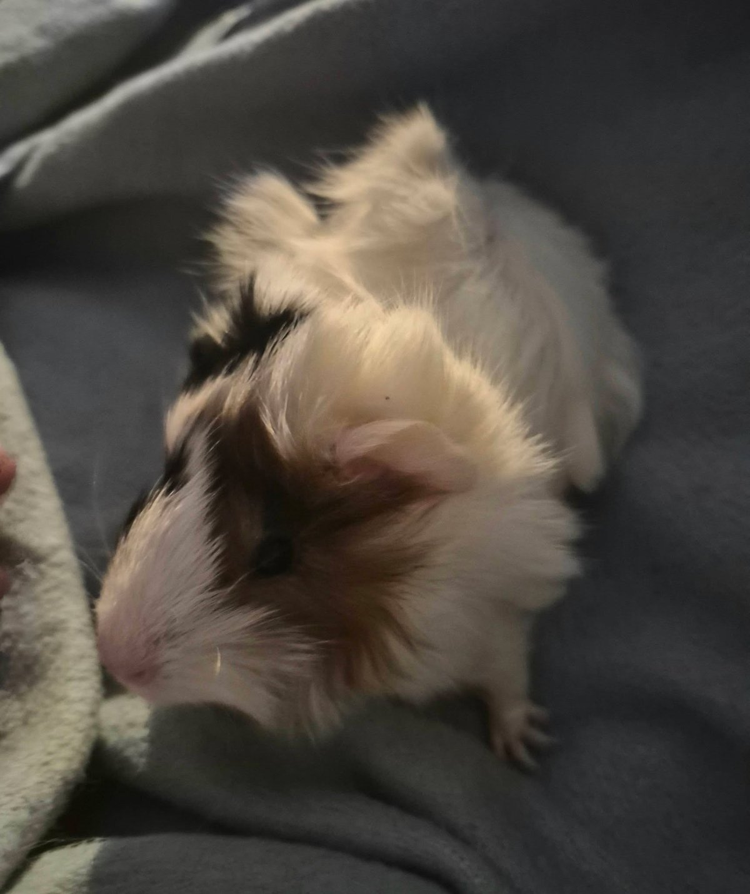
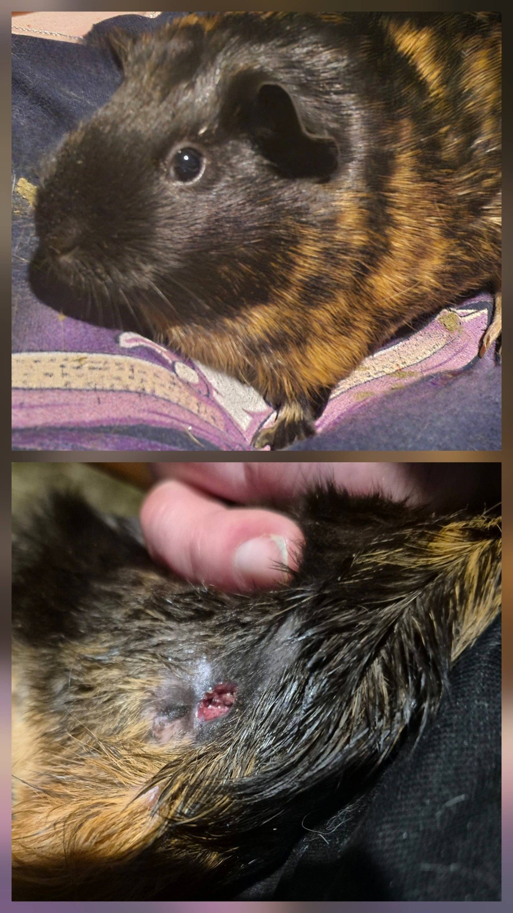

Yesterday was a big vet day, and we have updates on two of our special needs girls: Halloween and baby Sissy.

<!-- truncate -->

  
  

## Halloween: Abscess and Healing

Halloween has been through a lot. After her mammary tumor surgery, her incision site abscessed and burst, leaving a sizeable wound on her belly. It looked alarming — and honestly, it was. But the good news is that it is healing remarkably well. Dr. Ford is very pleased with her progress.

The concern going forward is that Halloween seems to abscess and develop infections more easily than average, which raises questions about her overall immune system. We are monitoring her closely and hoping that she will not need further surgeries. She is a resilient girl, and she has already proven she can bounce back from a lot.

## Sissy: Juvenile Cataracts

Baby Sissy's eyes have developed a cloudiness that we noticed recently — the kind you typically see in much older guinea pigs. After her exam, the diagnosis is **juvenile cataracts**. Whatever vision she currently has is likely blurry, and there is a possibility that she may go completely blind as she grows.

The good news is that Sissy is otherwise in excellent health. Guinea pigs adapt remarkably well to vision loss, relying on their other senses — particularly their sense of smell and spatial memory — to navigate their environment. With a stable, consistent living space and attentive care, blind guinea pigs can live full and happy lives.

We will continue to monitor her vision and make any adjustments to her environment as needed.

:::info Vision Loss in Guinea Pigs
Guinea pigs can develop cataracts from genetics, aging, or certain infections. Blind guinea pigs generally adapt well when their environment is kept consistent — avoid rearranging their space frequently, and use scent cues to help them orient. If you notice cloudiness in your guinea pig's eyes, have them evaluated by an exotic vet.
:::
