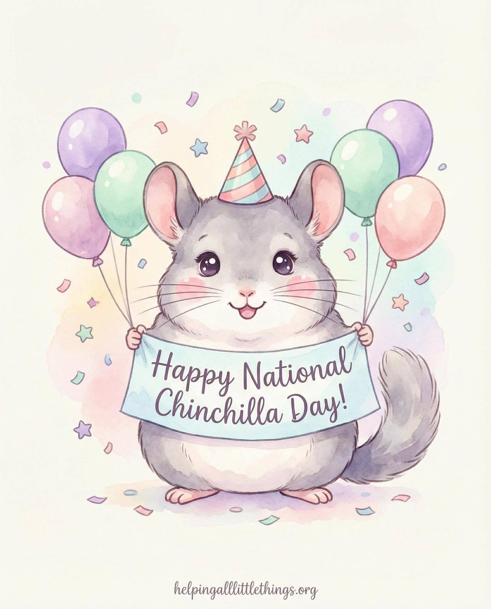
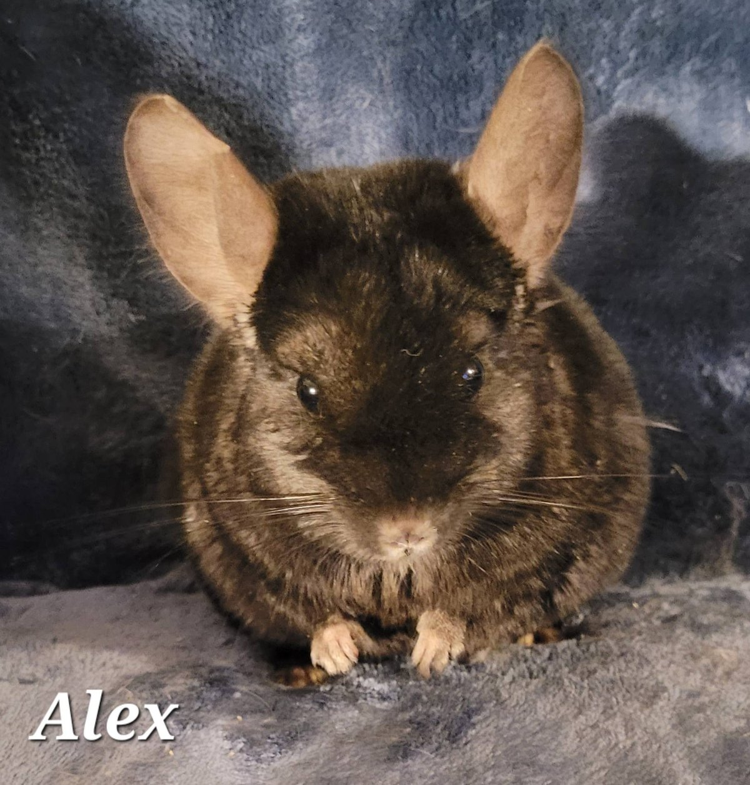
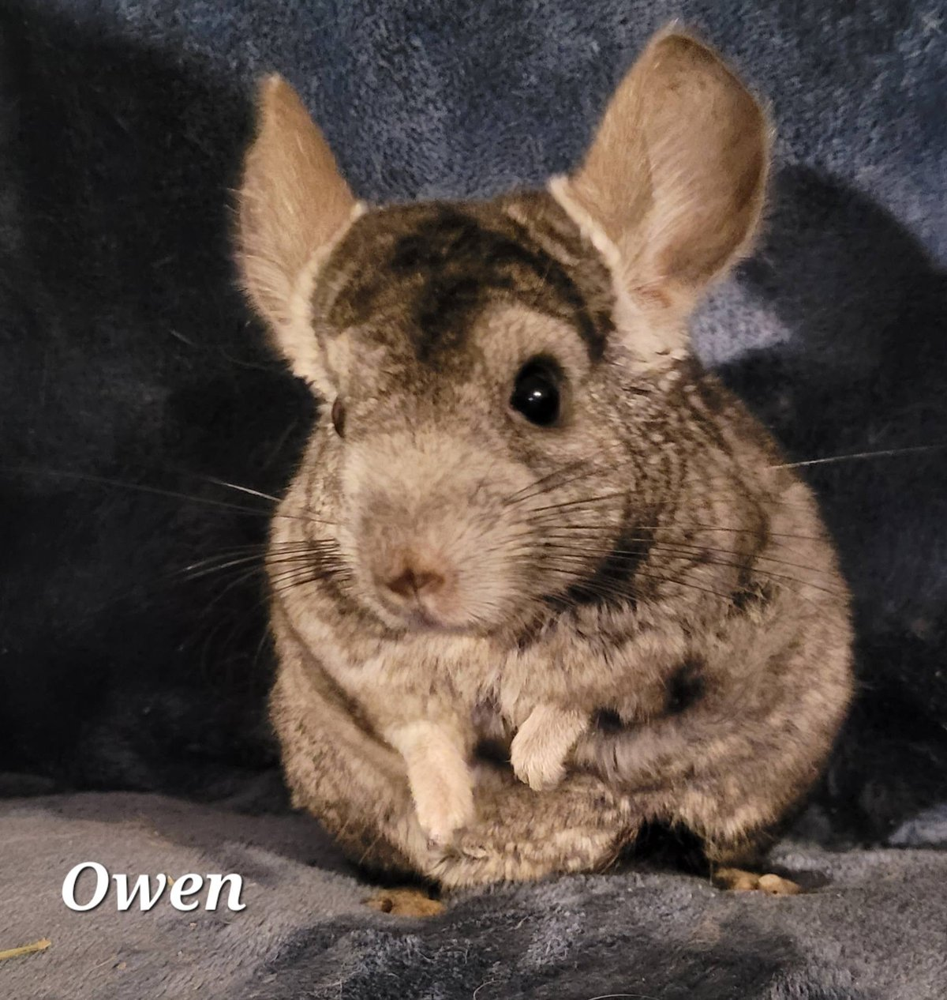
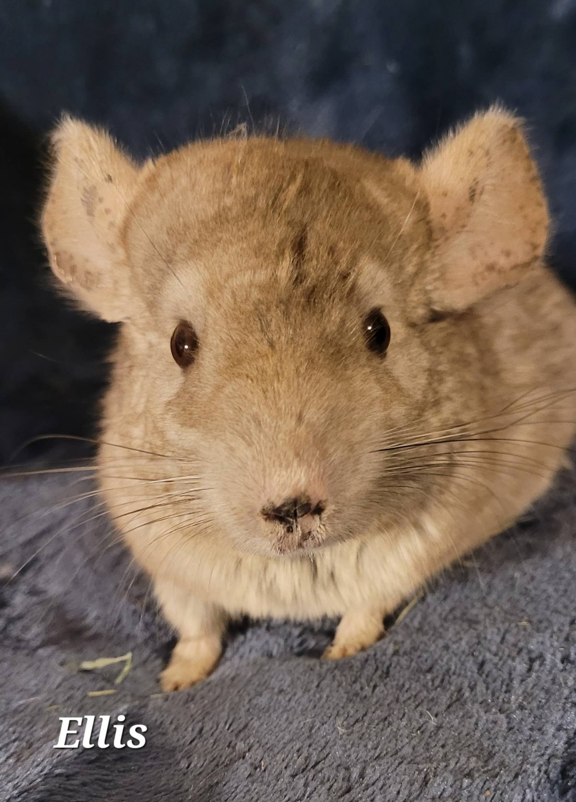
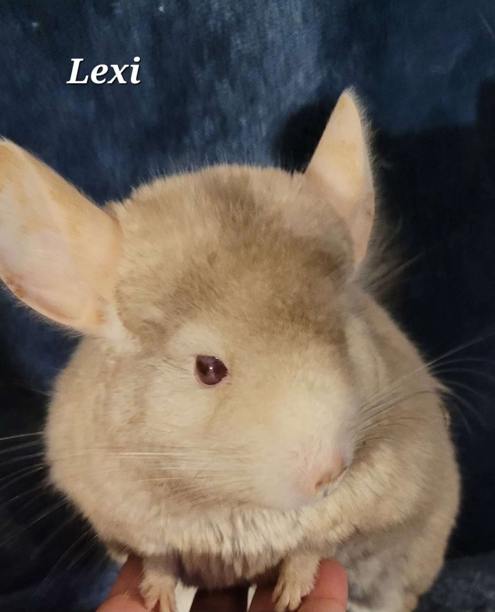
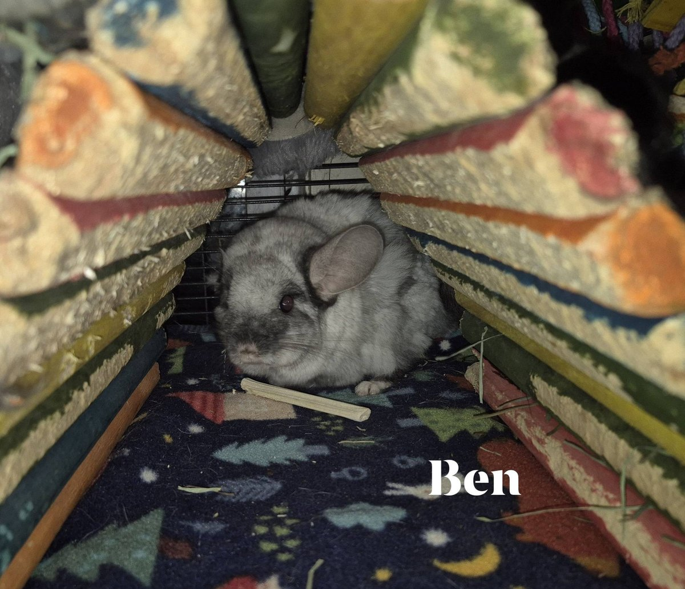

Did you know that March 23rd is National Chinchilla Day? We couldn't let it pass without introducing you to some of the very special chinchillas living in our New Hampshire sanctuary!

<!-- truncate -->

Most of our sanctuary chinchillas have Grey's Anatomy-inspired names — with a few notable exceptions. Morticia, Gomez, and Wednesday have their own story (that's a whole other post!). Each of these animals came to us with histories that made rehoming difficult, whether due to age, health challenges, or simply needing a quieter, more permanent arrangement than foster life could provide.

  
  
  
  
  
  

Chinchillas are often misunderstood as low-maintenance pets, but they are actually quite complex animals with specific environmental, dietary, and social needs. They can live 15 years or more, are highly sensitive to heat, and require dust baths, not water baths. They are most active at dawn and dusk, which makes them a wonderful match for night-owl households — but less ideal for young children who want a cuddly daytime companion.

:::tip Want to learn more about chinchillas?
We have a comprehensive care guide on our resources page covering everything from diet and housing to common health conditions. [Read our Chinchilla Care Guide →](/docs/Chinchillas/getting-started/chinchilla-care-guide)
:::

If you have chinchillas of your own, give them a gentle smooch and an extra (but healthy!) treat today. And if you've ever been curious about whether a chinchilla might be the right fit for your home, our resources are a great place to start.

🐭💨
