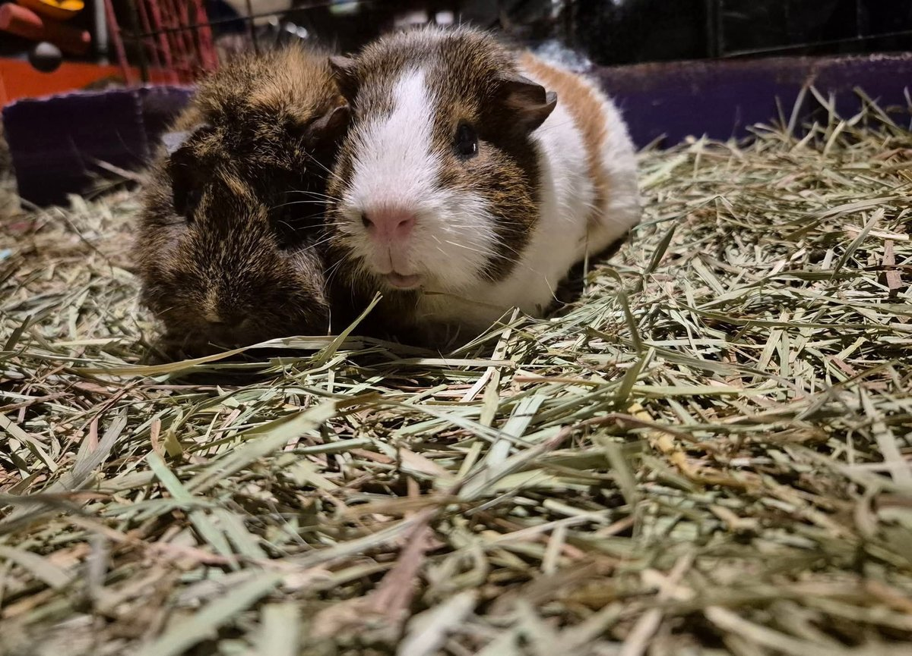

It is with a heavy heart that we share that Clara Bee passed away yesterday after a five-month fight against Congestive Heart Failure — on top of several other health challenges she had been managing since arriving at the sanctuary in June 2024.

<!-- truncate -->

*Clara Bee — full of spunk and abbytude right up until the end.*

Clara Bee was a fighter in every sense of the word. She was full of spunk and abbytude — that particular brand of Abyssinian guinea pig attitude that is equal parts exasperating and endearing — right up until her final days. She wasn't particularly fond of humans for most of her time with us, which meant we don't have as many photos of her as we'd like. But in her final weeks, something shifted. She decided she loved her medications and would take them willingly, without bolting for the hills. That small act of trust meant everything.

An inner ear infection had left her permanently wobbly, which understandably made being picked up frightening for her. We respected that. We gave her space, we gave her time, and we gave her the best medical care we could.

She leaves behind her sister, **Briella Mae**, who is also managing Congestive Heart Failure. We promise to take the very best care of Briella until the day they are reunited.

:::info About Congestive Heart Failure in Guinea Pigs
Heart disease is more common in guinea pigs than many people realize, and it can be managed with medication for months or even years. If your guinea pig is showing signs of labored breathing, lethargy, or weight loss, please see an exotic vet promptly.
[Read our guide on Heart Disease in Guinea Pigs →](/docs/guinea-pigs/illnesses-and-conditions/heart-disease)
:::

Popcorn free, sweet girl. 🌈
