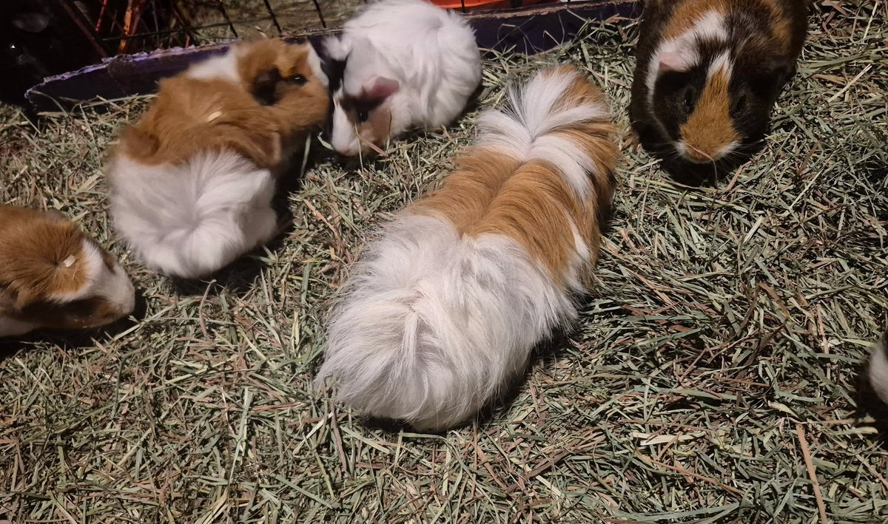

Baby Sissy had her first supervised visit with the big herd yesterday, and it went about as well as we could have hoped — with a few adorable complications.

<!-- truncate -->

*Sissy during her first supervised visit with the big herd.*

Sissy is still too small to move in full time. The main concern is the cats — not that they have ever shown any interest in the guinea pigs, but better safe than sorry when you have a tiny baby in an active herd environment. She will join the big group permanently once she has grown a bit more.

In the meantime, Sissy has been living with Matilda, who is on a modified rest schedule while we sort out her back issues. The two of them have formed an unexpectedly sweet bond. Sissy absolutely adores Matilda, and Matilda — who can be particular about her companions — is incredibly patient with her.

The family dynamics during the visit were interesting. Sissy's mom, Duchess (named by Alanna, since we already had multiple Fluffys on file), was absolutely over being a mom when it was just the two of them. She was quite rude to Sissy in their small shared space. But in the wide open herd environment, Duchess seemed to genuinely enjoy interacting with her daughter. Space, it turns out, makes a difference.

Red Sky, formerly known as Hot Cakes, was absolutely infatuated with Sissy from the moment she arrived. Overall: a very successful outing, and a good sign for Sissy's eventual full integration into the herd.

:::tip Introducing Young Guinea Pigs to a Herd
Young guinea pigs should be introduced to established herds gradually and with supervision. They need to be large enough that adult pigs cannot accidentally injure them during normal herd activity. Neutral territory introductions and short supervised visits are the safest approach before full integration.
[Read our Guinea Pig Care Guide →](/docs/guinea-pigs/getting-started/guinea-pig-care-guide)
:::
