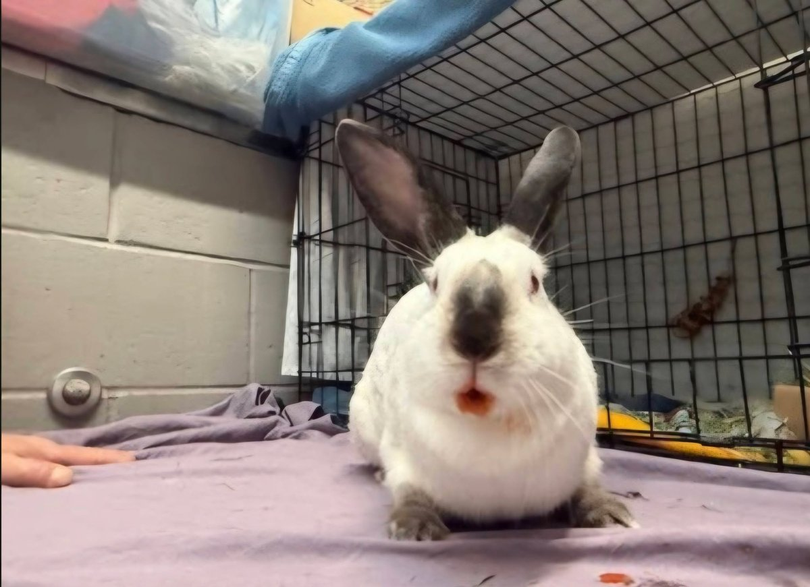
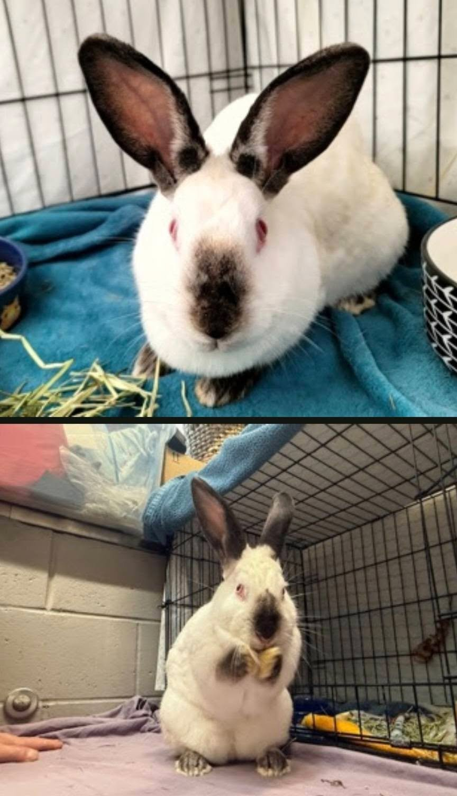

Sometimes the stars align in the most perfect way. Our friends at NYACC reached out looking for placement for a Californian bunny who had been waiting at one of their shelters for a long time. And as luck would have it, Danni's mom had been wanting a Californian bunny for ages.

<!-- truncate -->

  
  

*Tonks in her shelter photos — she had been waiting a long time for the right family.*

That was a no-brainer. Tonks — her shelter name, which may or may not stick — made the easiest transfer we've had in a while, going straight from NYACC to the absolute best bunny parents in the business. Danni's parents have a long and wonderful track record with rabbits, and Tonks is going to be very, very loved.

She's still settling in, so we'll post more photos once she's comfortable and showing off her full personality. But for now: **welcome to the good life, Tonks!** 🐇

:::tip Thinking about adopting a rabbit?
Rabbits are wonderful companions but often misunderstood. They have complex social, dietary, and environmental needs — and they can live 8–12 years! Before adopting, check out our [Rabbit Care Guide](/docs/Rabbits/getting-started/basic-care) to make sure a bunny is the right fit for your home.
:::
