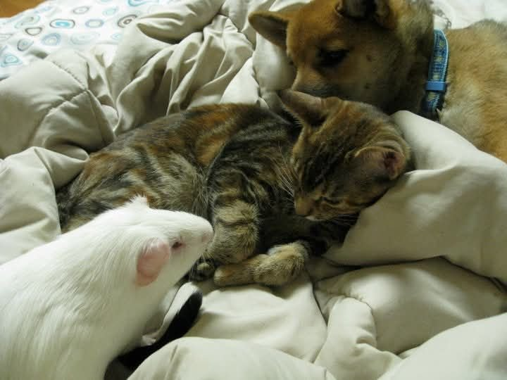

Going through old photos sometimes sends you down a beautiful rabbit hole. This week, Danni found a gem: a photo of Casper, one of the very first intakes when HALT was just getting started — and the guinea pig who taught her more than she ever expected.

<!-- truncate -->

*Casper — one of the very first intakes at HALT, and a little white pig who changed everything.*

Casper turned out to be a **lethal white** — a term that refers to guinea pigs born from two roan or Dalmatian-patterned parents. The genetic combination that produces this coat pattern also causes severe developmental abnormalities: lethal whites are typically blind, deaf, and have malformed digestive systems that make eating and digestion painful and difficult. They require intensive care and rarely live long lives, but with the right support, they can have quality time.

At the time, Danni was brand new to rescue and had no idea what she was looking at. She called her friend and mentor and described the little pig: *"This guinea pig is a little off. Is he white? Yes. Does he have red eyes? Yes."* The response was immediate: *"What you have is a lethal."*

Her mentor laughed — she had been doing guinea pig rescue for about ten years at that point and had never had a lethal come in. Danni's first few weeks, she got one. It must have been a sign of things to come.

Her mentor connected her with a friend who specialized in senior, hospice, and special needs small animals, and Casper was officially adopted into expert hands. That connection became a friendship, then a rescue partnership, and Danni learned an enormous amount about caring for animals with complex needs — knowledge that has shaped the way HALT operates to this day.

That mentor has since retired from rescue and is living her absolute best life. But the gratitude for everything she taught remains.

:::info What is a Lethal White Guinea Pig?
Lethal whites result from breeding two roan or Dalmatian-patterned guinea pigs together. The double-roan gene combination causes serious developmental issues. **Responsible breeders never pair two roan or Dalmatian pigs together for this reason.** If you're adopting from a breeder, always ask about their pairing practices.
[Read more about Lethal White Guinea Pigs →](/docs/guinea-pigs/breeds-and-genetics/lethalwhite)
:::
