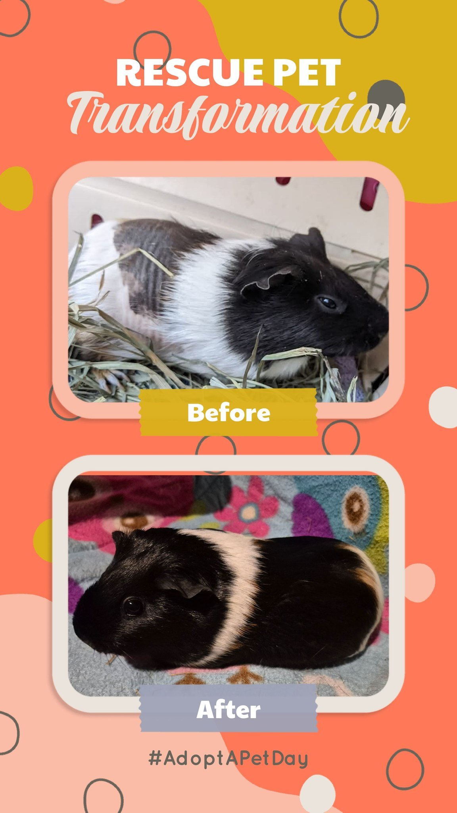

Today marks one year since Sonnet came into our lives — and what a year it has been. When she arrived, she was hairless and miserable, her body struggling with a hormonal condition that is genuinely rare even among guinea pig rescuers.

<!-- truncate -->

*Sonnet today — fully recovered, beautifully fluffy, and living her best life with Colin.*

Sonnet was diagnosed with **ovarian cysts and hyperplasia of the cervical tissue**. This condition accounts for less than 2% of biopsied uteruses in guinea pigs — it is that uncommon. What made her case even more striking was that Lyric, another guinea pig, came into the rescue with the exact same condition back to back. Two pigs, same rare diagnosis, within weeks of each other.

Both were spayed, and both recovered beautifully.

Sonnet today is unrecognizable from the hairless, uncomfortable pig who arrived a year ago. She has filled out, grown a gorgeous coat, and settled into life with Colin — a grumpy old man of a guinea pig who, it turns out, is not so grumpy anymore. At 6.5 years old, Colin is doing tiny popcorns again. That is entirely Sonnet's doing.

She is a petite girl and her exact age is difficult to determine because of it, but her spirit is enormous.

:::info Ovarian Cysts in Guinea Pigs
Ovarian cysts are actually one of the most common reproductive conditions in female guinea pigs over two years old, though the specific type Sonnet had — combined with cervical tissue hyperplasia — is quite rare. Signs include hair loss along the flanks, a swollen abdomen, and behavioral changes. Spaying is the most effective treatment.

If your guinea pig is showing these signs, please see an exotic vet experienced with small animals.
[Read more about Ovarian Cysts in guinea pigs →](/docs/guinea-pigs/illnesses-and-conditions/ovariancysts)
:::

Happy anniversary, Sonnet. You have no idea how much joy you have brought to this sanctuary — and to one very grumpy old man. 🌸
