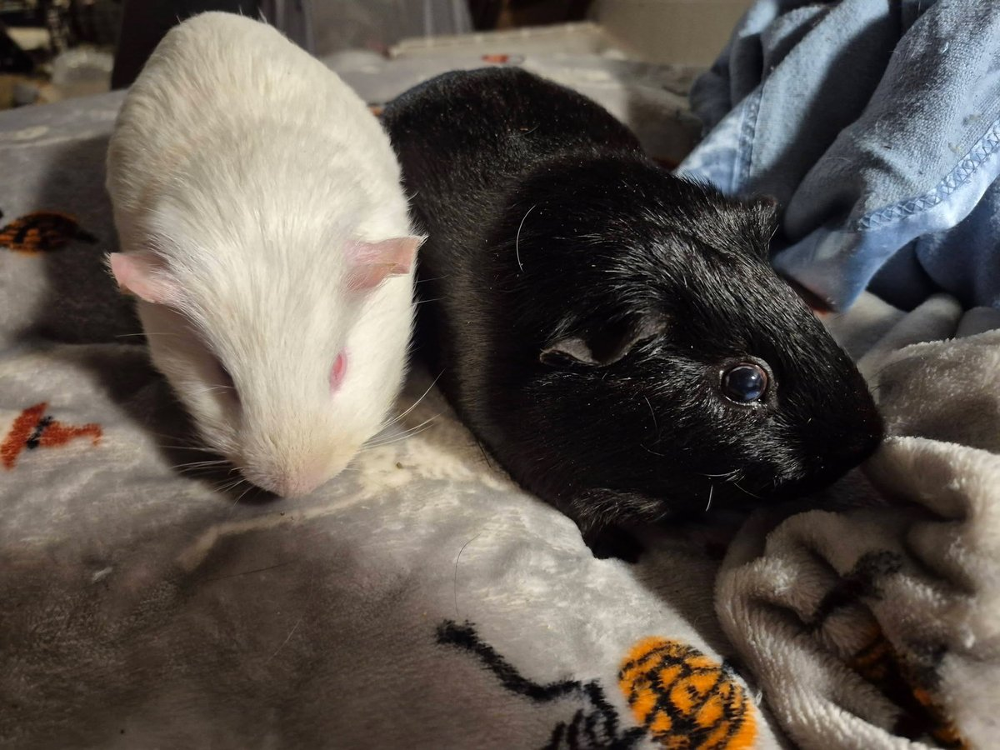
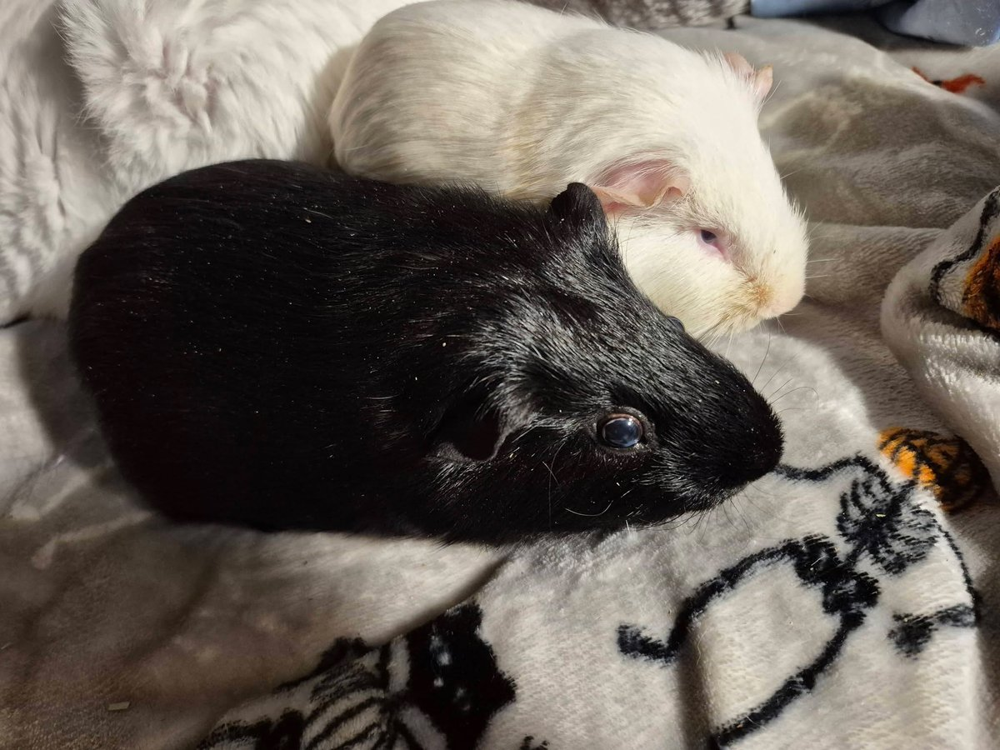
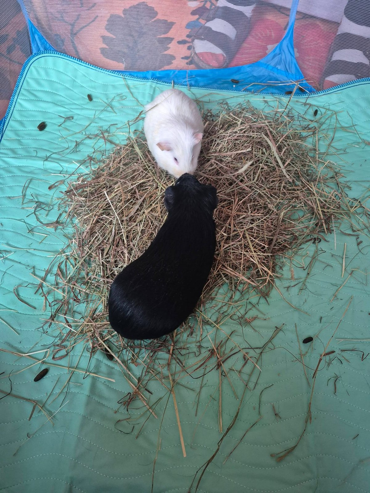

Hero has had a rough year. He is a senior guinea pig who has lost five companions in less than twelve months — every single one of them a super senior who passed before him. After Quest and Watson crossed the rainbow bridge, Hero became visibly depressed. He stopped being himself.

<!-- truncate -->

  
  

*Hero and his new companion Villain — formerly known as Pickles — getting acquainted.*

After visiting Southern Maine Veterinary for Matilda and Story's appointments, we made a detour to Auntie Betsy's house at [Wheektopia Rescue](https://www.facebook.com/wheektopiarescue). The goal: find Hero a friend who was younger than a super senior, but not a hormonal teenager either. Someone with some staying power who could keep him active and engaged.

Enter **Villain** (formerly Pickles).

Danni had actually met him not long ago when she and Betsy had back-to-back appointments at Southern Maine, and they both fell in love with each other immediately. At the time, bringing another pig home wasn't responsible. But as luck would have it, he was still available — and he and Hero get along beautifully.

*Villain is just the sweetest boy, full of kisses — despite the name.*

Hero is already more vibrant. There is a boar glue situation to sort out (anyone who has bonded male guinea pigs knows exactly what this means), but the important thing is that Hero is himself again.

Despite the name, Villain is just the sweetest boy, full of kisses. Hero and Villain is, admittedly, a very fun combination.

**A note on Twilight:** Betsy also kindly agreed to take on Twilight, who had come into HALT with Moonlight (a satin guinea pig who sadly passed not long after arrival). Twilight was quite aggressive with the special needs pigs in the sanctuary, so the fit just wasn't right for him here. Betsy has a number of healthy males, and we are hopeful that Twilight will bond with one of them and find a forever home.

:::tip Guinea Pig Bonding
Guinea pigs are highly social animals and should not live alone. When introducing new companions, especially adult males, a neutral territory introduction is essential. If you're bonding guinea pigs for the first time, our care guide has tips on safe introductions.
[Read our Guinea Pig Care Guide →](/docs/guinea-pigs/getting-started/guinea-pig-care-guide)
:::
