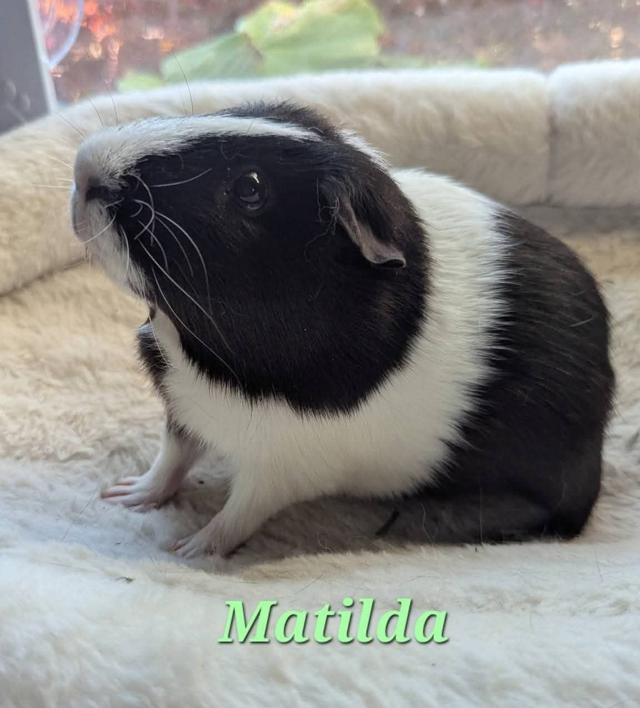

Matilda's arthritis has progressed significantly. The severity in her knee is now affecting the way she walks — more noticeably than her already distinctive gait. We are increasing her pain management and, importantly, beginning **Adequan trials** for the guinea pigs in our sanctuary with the most advanced cases of osteodystrophy and arthritis.

<!-- truncate -->

*Matilda, resting and receiving extra care as we adjust her pain management protocol.*

For those who have been following along: we ran an Adequan trial with Tally earlier this year, which showed promising results. Based on that experience, we are now expanding the trial to other pigs in the sanctuary who are dealing with advanced joint disease — the ones for whom the active, busy herd environment has become harder to navigate.

One of the immediate goals is to set up a dedicated 2×6 space for the pigs with advanced mobility issues. A calmer, more accessible environment will make a real difference in their daily quality of life while we work on the medical side.

Matilda is a fighter and has always adapted to whatever challenges come her way. We are hopeful that the combination of adjusted pain management and Adequan will give her more comfortable, mobile days ahead.

:::info About Adequan for Guinea Pigs
Adequan (polysulfated glycosaminoglycan) is an injectable medication typically used in dogs and horses for joint disease, but it has been used off-label in guinea pigs with promising results for managing arthritis and osteodystrophy. It works by supporting cartilage health and reducing inflammation in the joints. If your guinea pig is showing signs of joint pain or mobility issues, discuss all options with your exotic vet.

[Read about spine and musculoskeletal issues in guinea pigs →](/docs/guinea-pigs/illnesses-and-conditions/spine-issues)
:::
