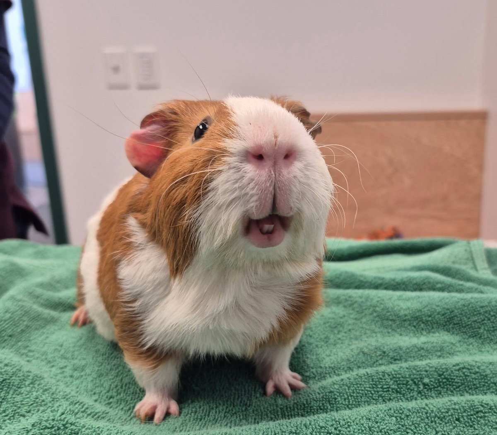

After a worrying week, we have good news: Story's lumps are not what we feared.

<!-- truncate -->

*Story being the absolute goodest boy at his appointment — even Dr. Ford wanted to take him home.*

Story had a couple of suspicious lumps that needed investigating, and we were understandably anxious heading into his appointment at Southern Maine Veterinary. But Story was the goodest boy throughout the whole visit, and the news was a relief: he has a small infection that triggered a lymph node to swell. After a course of antibiotics, he should be completely back to normal.

Dr. Ford was so charmed by Story that he reportedly wanted to take him home. We understand completely.

Story will be on antibiotics for the next little while, and we will keep everyone updated on his progress. For now, he is comfortable, eating well, and being his usual photogenic self.

:::info Lumps in Guinea Pigs
Not every lump in a guinea pig is cause for alarm — lymph node swelling from infections is common and very treatable. However, lumps should always be evaluated by an exotic vet, as they can also indicate abscesses, cysts, or tumors. Early detection makes a significant difference in outcomes.
[Read about common health conditions in guinea pigs →](/docs/guinea-pigs/illnesses-and-conditions/common-health-issues)
:::
