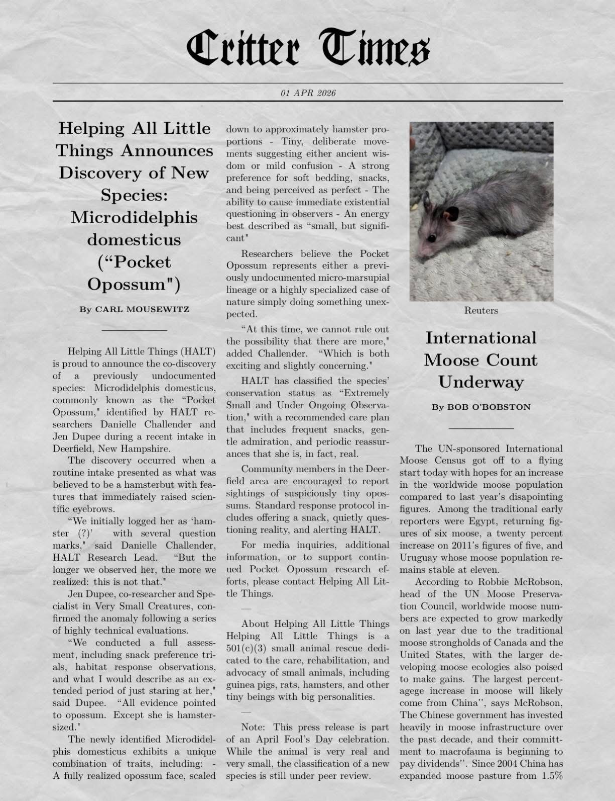

Helping All Little Things (HALT) has announced the discovery of *Microdidelphis domesticus*, or the **"Pocket Opossum,"** identified during a recent intake by:

- **Danni**, President & Small Animal Specialist
- **Jen**, Board Member & Even Smaller Animal Specialist

The animal was initially logged as *"hamster (?)"*… but quickly raised concerns.

<!-- truncate -->

"The longer we looked, the clearer it became — this is not a hamster," said Danni.

"We ran extensive tests: snack trials, habitat observations, and a lot of staring," added Jen. "Conclusion: opossum. But tiny."

## Key Traits

- Opossum face, hamster-sized body
- Small, deliberate movements (wise? confused?)
- Strong preference for snacks and soft bedding
- Causes immediate existential questioning
- Vibe: small, but significant

Researchers are split between *"new micro-marsupial"* and *"nature just doing something weird again."*

HALT has classified the species as **"Extremely Small"** and recommends care involving snacks, admiration, and gentle reassurance.

Sightings of suspiciously tiny opossums should be reported immediately.

---

*Note: This is an April Fool's release. The animal is real. The science… pending.*

*#AprilFools*

<SupportUs />
