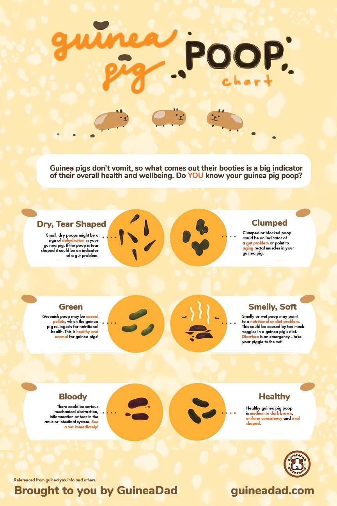

# Guinea Pig Poop

Guinea pigs have sensitive digestive systems, and looking at their poop is the best way to quickly determine how your guinea pig's system is functioning. It's also one of the reasons why it's so important to clean their cage frequently, preferably doing a daily spot clean, allowing you to observe their poop every day, as immediate intervention is required in the event there is a problem.

## Healthy Guinea Pig Poop

Healthy guinea pig poop is should be smooth with an oval shape, and round ends. It should be dark to medium brown and might be slightly shiny. It should be 1-2 cm long and firm, not too soft or hard. And healthy poop should not be smelly. 

## Cecal Pellets

Fun fact - guinea pigs are coprophagic, which means they eat their own poop! This seems gross, but it's an essential part of their digestive process that allows them to get all of the nutrients from their diet. 

Guinea pigs produce a specific kind of poop called cecal pellets that they will ingest. These poops may range in color from mustard yellow to green to dark brown, and may be soft or slimy, and have a smell to them. You may seem them in a small clump.

Guinea pigs will usually produce these pellets a few times a day, though you may not see them as they often consume them straight from the source. 

## Small, Dry, Crumbly Poop

Poop that is small, dry, or crumbly is a sign of dehydration. If you notice these, make sure your piggies have enough water, and that they are able to access it. 

You can also give them food that contains more water, like cucumbers, water, and blueberries. 

If these poops continue, or if you notice other signs of dehydration, take your piggie to the vet. Other signs of dehydration include: 

- crusty eyes
- lethargy
- reduced urine output (another reason for daily cage cleaning)
- poor appetite

## Tear-shaped Poop

Poop that is tear-shaped is a sign that your piggie is not eating enough fiber - their diet should be 80% hay. They should have access to unlimited clean, dry hay and should eat a pile of hay about the size of their body each day. 

Tear-shaped poop can also be a sign of dehydration, so ensure your pig is getting enough water, as well. 

## Smelly, Soft Poop

Soft, smelly poop or diarrhea is usually a sign of an infection, and can be very dangerous quickly, so see your vet immediately. 

Poop from a sick pig looks difference from cecal pellets. Cecal pellets are soft but still well-formed. A sick pig will have soft poops that are not well-formed. Cecal pellets will have a bit of a poop smell, but not a foul smell, like a sick pig may have.

## Clumped Poop

Clumped poop is more often seen in older pigs, usually males, who are beginning to have issues with weakened rectal muscles. Fecal impaction can become a risk if you are seeing clumped poop for more than a day, or if you see your pig straining or in pain while trying to poop. If this occurs, see your vet. 

## Bloody Poop

If you see any blood in your guinea pig's poop, take them to the vet immediately. 

This excellent chart from GuineaDad gives an overview of the types of guinea pig poop. 

