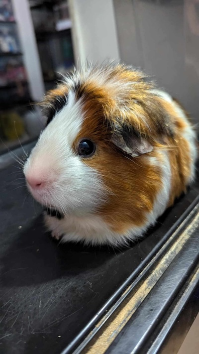
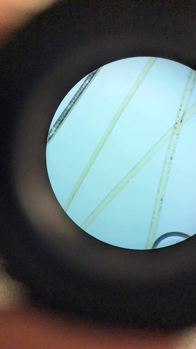
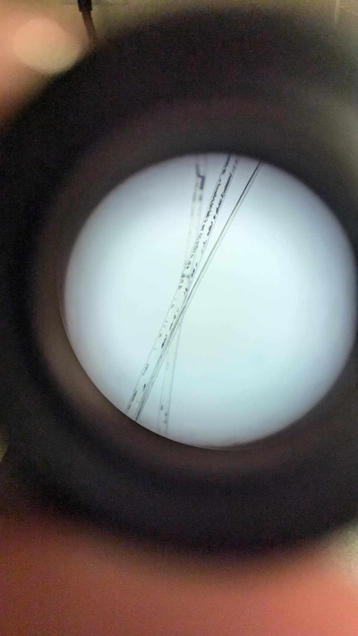

# Satin Syndrome in Guinea Pigs

If you’re a guinea pig owner or enthusiast, it’s crucial to be aware of the health conditions that can affect your furry companions. One such condition is **Satin Syndrome**, a disease that primarily affects satin-coated guinea pigs. While these guinea pigs are prized for their beautiful, glossy fur, they are at higher risk of developing a painful and often debilitating condition that affects their bones and organs.

In this post, we’ll explore what Satin Syndrome is, the signs and symptoms to watch for, and how it can be managed to ensure your guinea pig lives a comfortable life.

<figure>
      
    <figcaption>Satin guinea pig</figcaption>
</figure>

## What is Satin Syndrome?

Satin Syndrome is a collection of symptoms that together are referred to as Satin Syndrome. While osteodystrophy is the most well-known and difficult aspect of this syndrome, there are many other aspects. 

Satin guinea pigs are known for their beautiful fur, but under a microscope, their hair shafts are hollow. Unfortunately, this hollow hair structure may be linked to metabolic issues that can affect bone health.

**Osteodystrophy is** a condition that affects the bones of satin-coated guinea pigs, causing them to become weak, brittle, and deformed over time. These animals are no longer absorbing calcium. 

Osteodystrophy can lead to **osteoporosis-like** symptoms in guinea pigs, and as the condition progresses, it can cause extreme pain, mobility issues, and fractures. The exact cause of Satin Syndrome is still being studied, but it’s believed that a calcium metabolism disorder might play a key role in the development of the disease.

**Kidney disease can also occur in these animals, as well as heart disease** \- which can lead to cardiac arrest

Compare the following photos of guinea pig hair under a microscope.

<figure>
    
  <figcaption>X Ray of a healthy guinea pig hair</figcaption>
</figure>

<figure>
    
  <figcaption>X Ray of a satin guinea pig hair</figcaption>
</figure>

## Signs and Symptoms of Satin Syndrome

Satin Syndrome usually manifests in adulthood, often between 1-2 years of age, but it can sometimes appear earlier or later in life. Unfortunately, by the time symptoms are noticeable, the disease may already be advanced.

Here are the common signs to watch for \- download our detailed printable checklist here: [Satin Syndrome Printable Checklist](satin-checklist.pdf).

1. **Difficulty Moving**: One of the earliest signs of Satin Syndrome is difficulty moving or limping. Your guinea pig may struggle to hop, climb, or move around its enclosure. You may notice them becoming less active, preferring to stay in one spot or lying down more often.  
2. **Hunched Posture**: A hunched, stiff posture is a telltale sign of discomfort or pain in guinea pigs with Satin Syndrome. This is often due to bone pain, especially in the spine and legs, caused by the weakening of their skeletal structure.  
3. **Weight Loss or Appetite Changes**: As the disease progresses, guinea pigs with Satin Syndrome may lose their appetite, leading to weight loss. Painful joints and difficulty moving may also make it harder for them to access food or water.  
4. **Bone Deformities**: Over time, bones may become visibly deformed, particularly in the limbs or spine. This deformity is caused by the bones becoming soft and weak, which leads to abnormal growth and changes in structure.  
5. **Fragile Bones**: Guinea pigs with Satin Syndrome are more prone to bone fractures, even with minor impacts or normal activities like hopping or running. If your guinea pig seems to be in sudden pain or is unable to move a limb, it could be due to a fracture caused by weakened bones.  
6. **Tooth Problems**: Because guinea pigs’ teeth grow continuously throughout their lives, any changes in bone structure can affect the alignment of their teeth. Malocclusion (misaligned teeth) may develop, leading to problems with eating, drooling, or weight loss.

If these symptoms sound familiar, please download our extensive checklist: [Satin Syndrome Printable Checklist](satin-checklist.pdf).

## Diagnosing Satin Syndrome

If you notice any of the signs mentioned above, it’s important to take your guinea pig to a veterinarian who specializes in small animals or exotics. Satin Syndrome is typically diagnosed through a combination of **physical examination**, **X-rays**, and an evaluation of your guinea pig’s symptoms.

* **X-rays** are the most effective way to diagnose Satin Syndrome, as they can reveal changes in bone density, deformities, and fractures.

* The hair shaft of a satin will appear hollow under a **microscope**. 

* **Bloodwork** may also be conducted to check calcium and phosphorus levels, although the exact cause of the syndrome remains unclear and may not always be reflected in these tests.

## Managing Satin Syndrome

Unfortunately, there is no cure for Satin Syndrome, but with the right care and treatment, you can help your guinea pig live a more comfortable life.

1. **Pain Management:** Pain relief is one of the most important aspects of treatment. Your veterinarian may prescribe non-steroidal anti-inflammatory drugs (NSAIDs) or other medications to help reduce pain and inflammation.  
2. **Supplements:** Some vets recommend calcium supplements to support bone health. However, this must be carefully managed, as an imbalance of calcium and phosphorus can cause other health problems, such as bladder stones. Always follow your vet’s advice when it comes to supplementation.  
3. **Modified Living Environment:** Create a comfortable and safe living space for your guinea pig to minimize the risk of injury. Consider soft bedding, ramps instead of steps, and ensuring food and water are easily accessible to reduce the need for strenuous movement.  
4. **Physical Therapy:** In some cases, light physical therapy may be recommended to help maintain muscle strength and mobility. However, this should be done under the guidance of a veterinarian to avoid causing further harm.  
5. **Special Diet:** Providing a balanced diet rich in vitamin D and calcium can support overall bone health. However, be cautious with the amount of calcium, as excess calcium can lead to other issues like bladder stones. Fresh hay, leafy greens, and high-quality pellets should be staples in your guinea pig’s diet. As the disease progresses, you will need to feed your guinea pig a high-quality recovery food like Sherwood or Oxbow.  
6. **Frequent Vet Check-ups:** Regular veterinary check-ups are crucial for monitoring the progression of the disease. Your vet may recommend periodic X-rays to check for further changes in bone density and structure.

## Can Satin Syndrome Be Prevented?

There’s no surefire way to prevent Satin Syndrome, as it appears to be linked to genetics and the unique coat type of satin guinea pigs. If you are adopting or purchasing a guinea pig, it’s important to ask about the breeding practices of the seller. Reputable breeders will avoid breeding satins that show signs of osteodystrophy to reduce the likelihood of passing on the condition.

## Final Thoughts

Satin Syndrome is a heartbreaking condition for guinea pigs and their owners alike, but early detection and proper care can make a significant difference in managing the disease. If your guinea pig has a satin coat, it’s essential to be vigilant about their health and watch for any signs of discomfort or bone issues. By working closely with your veterinarian, you can help ensure that your guinea pig enjoys a comfortable and fulfilling life, even with Satin Syndrome. 

From the bottom of our hearts: caring for a guinea pig with Satin Syndrome is very difficult. They can continue to live for many years, often requiring around-the-clock feeding and medication. This is not to discourage anyone from caring for their pet, nor do we believe they should be euthanized before they are ready. However, you may want to consider your lifestyle, working hours, and the amount of time you can dedicate if your guinea pig is diagnosed with Satin Syndrome, and reach out to a local rescue for help or to make a plan for when their care becomes difficult.   
