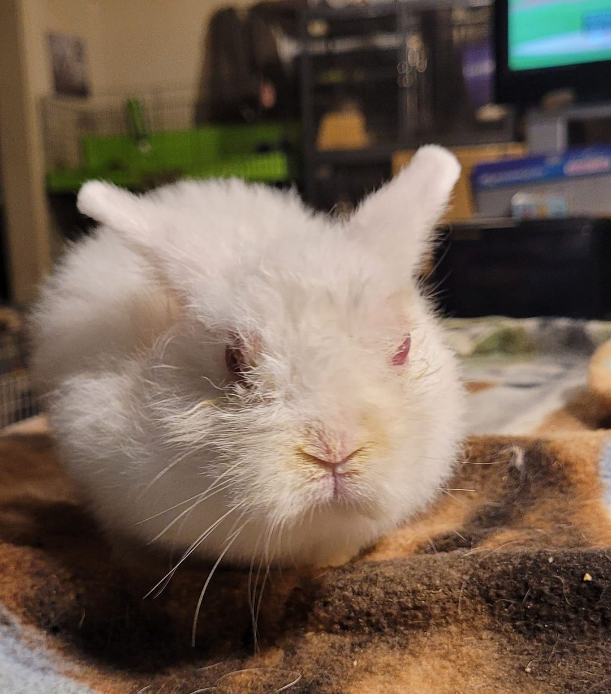

# Max Factor Rabbits

Max Factor rabbits are a rare and unique type of rabbit affected by a genetic mutation that results in unusual physical characteristics. These rabbits have striking appearances due to differences in their fur and limbs. It’s said that the condition is named after a rabbit named Max who was known to have the condition, but not much is known about the defect or its origin. However, the mutation also affects their health and mobility, creating both challenges and specific care needs. Here’s everything you need to know about Max Factor rabbits, from their characteristics to the ethics of breeding them.

## What Are Max Factor Rabbits?

Max Factor is a colloquial term used to describe rabbits with a genetic mutation that causes them to have extra-soft, velvety fur and, more distinctively, limb deformities. This condition is caused by a recessive gene mutation, meaning it only appears when both parents carry the gene. It’s most often seen in certain breeds, often in Netherland Dwarf rabbits, but it can potentially occur in any rabbit breed with the right genetic combination.

## Physical Characteristics of Max Factor Rabbits

Max Factor rabbits have unique physical traits that distinguish them from other rabbits. Key features include:

1. **Soft, Velvety Fur**: Many Max Factor rabbits have extremely soft and plush fur, which is often short and velvety, similar to a Rex rabbit’s fur. This trait is highly prized in the rabbit fancy world but can sometimes require extra grooming to keep the coat healthy.  
2. **Limb Deformities**: One of the most significant aspects of Max Factor rabbits is their limb deformities, which make it difficult or impossible for them to hop and move like a typical rabbit. The mutation can cause legs to be twisted or “splayed,” preventing normal mobility.  
3. **Splayed or Bent Toes and Feet**: Many Max Factor rabbits have splayed toes and bent feet, which can lead to challenges in standing and moving, and may necessitate additional bedding and support. Their feet may resemble flippers, they may be webbed, and their hind legs may have a dew claw.  
4. **Vision Problems:** Max Factor kits may be born with their eyes partially or fully open (when they should not yet be open), leading to blindness.  
5. **Overall Fragility**: Due to their deformities and mobility limitations, Max Factor rabbits are often more fragile than other rabbits, which may limit their lifespan and require specialized care. Many Max Factor rabbits do not make it past infancy, and more do not make it to adulthood. 

## Challenges and Care Needs of Max Factor Rabbits

Because of their limb deformities, Max Factor rabbits face several challenges that require special attention from caretakers. Here’s a closer look at their needs:

1. **Mobility Support**: Many Max Factor rabbits cannot hop or move normally due to their limb deformities. They may need special accommodations, such as soft bedding, low-entry litter boxes, and assistance with movement to prevent pressure sores and maintain comfort.  
2. **Protection from Injury**: With their limited mobility, Max Factor rabbits are at higher risk of injuries from falls, slips, or overexertion. They may need a carefully padded environment and should be handled gently to prevent further stress on their delicate limbs.  
3. **Hygiene and Grooming**: Due to their restricted movement, these rabbits may have difficulty cleaning themselves. Caregivers often need to assist with grooming and may need to bathe them occasionally to prevent urine scalding and ensure they stay clean and comfortable.  
4. **Special Diet and Feeding Setup**: To prevent strain, Max Factor rabbits may benefit from low feeding dishes or specialized setups that allow them to access food and water comfortably.

## Ethical Considerations: The Debate Around Breeding Max Factor Rabbits

The unique appearance of Max Factor rabbits has led to some demand for them among rabbit enthusiasts, but their health complications raise ethical concerns about intentional breeding.

	•	**Genetic Challenges**: The mutation that causes the Max Factor traits is recessive, meaning it only appears if both parents carry the gene. Unfortunately, when these rabbits are bred, there’s a high risk of passing along the same physical challenges, potentially leading to more animals with mobility issues and decreased lifespan and quality of life.

	•	**Quality of Life**: Many breeders and animal welfare advocates argue against breeding Max Factor rabbits due to the associated health complications and reduced quality of life. Since these rabbits often experience physical pain and limitations, their condition raises questions about whether it’s ethical to intentionally breed for such traits.

	•	**Responsible Caregiving**: Rather than breeding for Max Factor traits, most experts suggest focusing on rescuing and rehoming Max Factor rabbits that are born unintentionally. People interested in caring for these rabbits should be prepared to meet their unique needs and provide a safe, supportive environment. Breeders who are responsible for bringing these disabled animals into the world often hand off the responsibility of caring for them to rescues, which are already overloaded with healthy rabbits. HALT is against any kind of unethical breeding and we stand very firmly against breeding any rabbits known or suspected to carry the Max Factor gene.

## Final Thoughts: Choosing Compassion Over Aesthetics

Max Factor rabbits are fascinating but complex animals, whose unique traits bring both aesthetic appeal and significant health challenges. For those caring for these rabbits, understanding their specific needs and creating a supportive, comfortable environment is essential. However, intentional breeding of Max Factor rabbits remains controversial due to the potential for suffering caused by their physical limitations.

If you’re interested in adopting a Max Factor rabbit, approach the decision with care and compassion. These special rabbits can be loving companions, but they require dedicated caretakers who are committed to meeting their unique needs and supporting their well-being. By focusing on responsible care rather than intentional breeding, we can help ensure Max Factor rabbits enjoy the highest quality of life possible.

