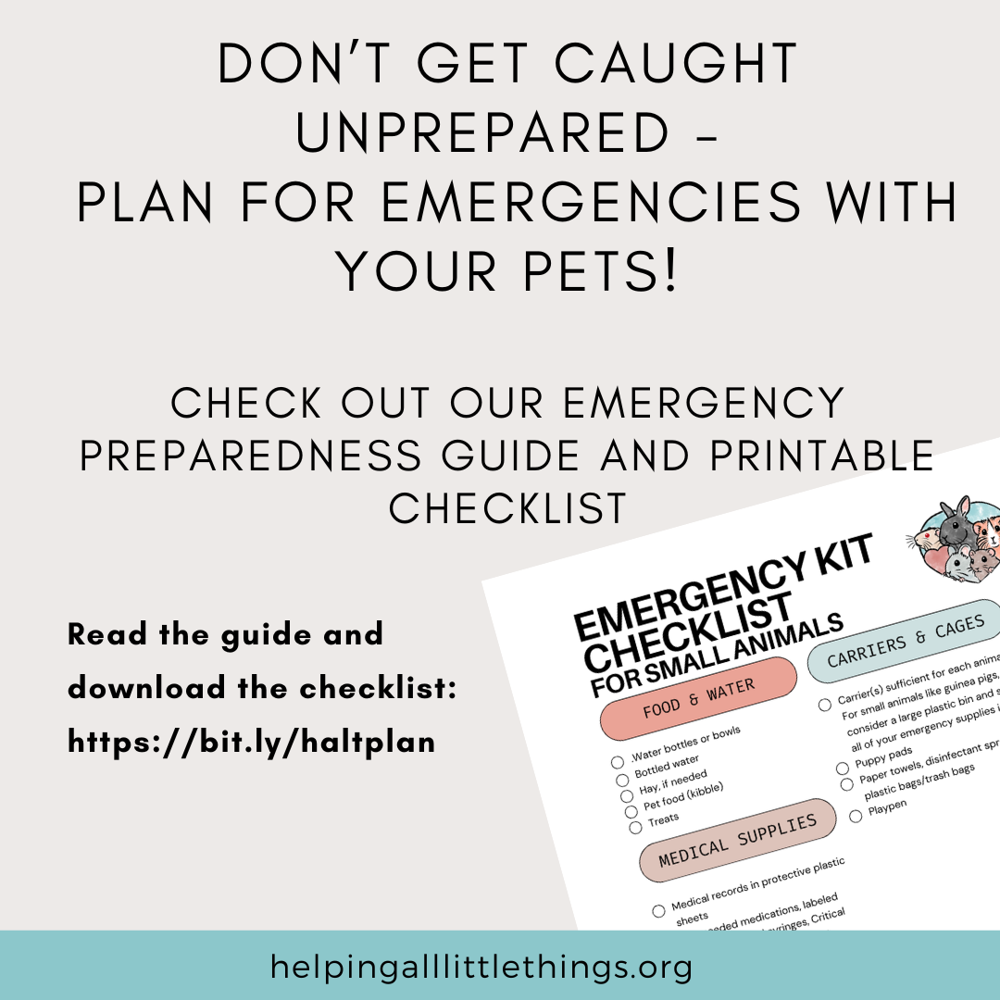

# Emergency Preparedness

## 1. Create an Emergency Plan
  - __Identify Safe Locations__: Know where the nearest pet-friendly shelters, hotels, or boarding facilities are located. Some shelters may not allow pets unless they are service animals, so it’s crucial to find pet-friendly options ahead of time.
  - Emergency shelters operating for the disaster may also allow pets, but make sure to check before you go. Have these locations and numbers saved so you aren’t scrambling in an emergency.
  - __Evacuation Routes__: Plan multiple evacuation routes in case your primary route becomes inaccessible.
  - Assign Responsibilities: If you live with others, decide who will be responsible for gathering each pet and their supplies in an emergency.
## 2. Build a Pet Emergency Kit
  - __Food & Water__: At least a 7-day supply of pet food and water. Include collapsible bowls for easy feeding. For small animals, bring critical care and oral syringes for feeding. Hay for small animals can take up a lot of room, but it may also be hard to find in an emergency, so set aside as big a package as you can, as it’s so essential for animals like guinea pigs and rabbits.
  - __Medications__: Keep a week’s supply of any medications your pet needs, along with copies of medical records, vaccination information, and prescriptions in a waterproof container. 
  - If your pet relies on a life-saving medication, such as insulin, consider adding a tag to their collar indicating that. Ensure that you have all of that information printed and laminated/stored in a waterproof container that is easy to locate should first responders or other helpers need to assist your pet without you. 
 - Consider bringing medications to treat conditions like stasis that may occur during stressful times. If your pet does poorly while traveling and needs to be medicated, talk to your vet about ensuring you have any needed medications on hand. 
  - __Identification__: Microchip your pet and ensure that the information is kept up to date. If you aren’t sure of your microchip information, your vet can scan the chip and give you the chip information so that you can update it. You can microchip even the smallest pets!
  - If you have dogs or cats, a collar with tags will help with identification. In major emergency situations, some people use a sharpie to write their contact info on their dog’s belly in the event that they are separated. 
  - Also, keep a photo of your pet in case you need to prove ownership.
  - __Sanitation__: Include disposable litter trays, litter or puppy pads, poop bags, plastic bags, disinfectants, and paper towels.
  - If you use fleece for your pet's cage, bring extra. You may also want to consider using disposable paper bedding such as carefresh for emergencies, since you may be unable to launder fleece. 
  - __Comfort Items__: Familiar items like a blanket or toy to help keep your pet calm.
  - __First Aid Kit__: Include basic supplies like bandages, tweezers, pet-safe antiseptic, and any specific items recommended by your vet.
  - __Crate/Carrier__: Make sure each pet has a sturdy, well-ventilated crate or carrier. It should be big enough for them to stand, turn around, and lie down comfortably. 
  - For small animals, consider using something like a large plastic tub as your emergency carrier. You can keep one with all of your emergency supplies ready to go, and should you need to evacuate, grab your small pets, put them in the bin, and go. 
  - For animals like rabbits and guinea pigs, consider packing a small pen that you can set up if you are settled in a hotel, for example, This will help keep your pet active and prevent conditions such as stasis. 
## 3. Plan for Shelter-in-Place
  - If evacuating is not possible, identify a safe space in your home, such as an interior room on the lowest floor with no windows.
  - Ensure that your pets are kept indoors during a storm. Never leave them outside, tethered, or in a garage, as conditions can deteriorate quickly.
  - Close off any unsafe areas of the house, like attics, and keep emergency supplies in the designated room with you.
## 4. Know Your Pet’s Behavior
  - __Stress Reactions__: Pets can become disoriented, stressed, or panicked in emergencies. Practice crate training and handling so they’re used to staying calm in unfamiliar settings. 
  - Sensitive animals like rabbits may refuse to eat or stop pooping and wind up in stasis. Ensure that you know the signs and have supplies on hand to treat your rabbit if you are unable to get to the vet in an emergency situation. 
  - __Leashing/Caging__: Keep cats and dogs on a leash or in carriers. Even the calmest pets can run off or hide during stressful situations.
## 5. Prepare for Extended Displacement
  - __Temporary Shelter__: Have a list of friends, relatives, or boarding facilities that could take your pets temporarily if you can’t bring them to an emergency shelter.
  - __Return Home Safely__: Don’t return home until authorities say it’s safe. Natural disasters can leave debris, downed power lines, or other hazards that could harm your pets.
## 6. Monitor the Situation
  - Stay informed about the storm through the National Weather Service or local authorities, and be prepared to act quickly if evacuation orders are given.
  - __Stay Updated__: Keep your phone charged, monitor weather alerts, and follow instructions from emergency officials to determine the best course of action.
## 7. After the Disaster
  - __Inspect Your Home__: Before allowing your pets to roam freely, inspect the area for hazards such as broken glass, exposed wires, or standing water.
  - __Behavior Changes__: Pets may be anxious, agitated, or even aggressive after a traumatic event. Provide them with patience and a safe, calm environment as they readjust.

## [>Download our Emergency Preparedness Printable Checklist](emergencychecklist.pdf)

By preparing in advance and ensuring that your pets are part of your emergency plan, you can keep them safe and reduce stress during a natural disaster.
