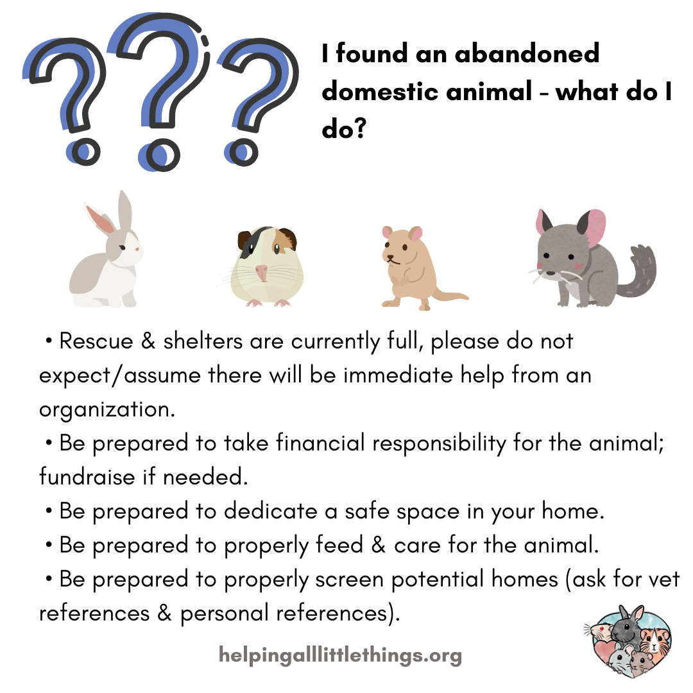

# Help, I Found a Pet!

* Is it a pet?
* Is it a wild animal?
  * How to tell a wild rabbit from a pet rabbit 

What to Do if You Find an Abandoned Domestic Animal
 - Rescue & shelters are currently full, please do not expect/assume there will be immediate help from an organization.
 - Be prepared to take financial responsibility for the animal; fundraise if needed.
 - Be prepared to dedicate a safe space in your home.
 - Be prepared to properly feed & care for the animal.
 - Be prepared to properly screen potential homes (ask for vet references & personal references).

