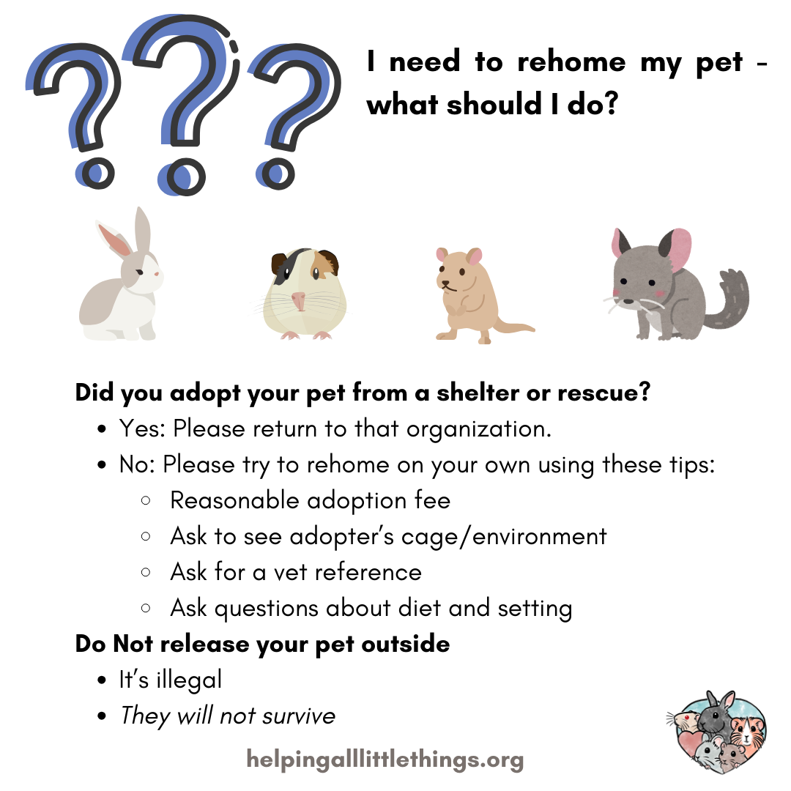

# How to Rehome a Pet

We all hope to keep our pets forever, but sometimes life happens and unfortunately, we have to find a new home for our pets. Here is some advice for safely rehoming your pets. 

Did you adopt your pet from a shelter or rescue?
 - Yes: Please return to that organization.
 - No: Please try to rehome on your own using these tips:
   - Reasonable adoption fee
   - Ask to see adopter’s cage/environment
   - Ask for a vet reference
   - Ask questions about diet and setting

Do Not release your pet outside
 - It’s illegal
 - _They will not survive_

